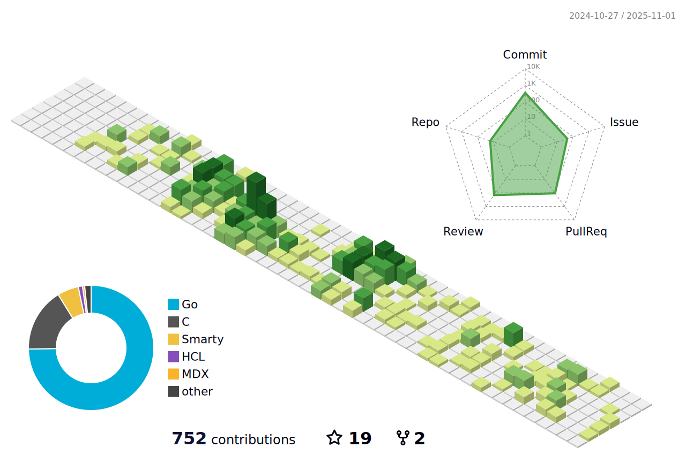

---

## Links

<!--
                                           
-->

## [Projects](https://github.com/alexandreLamarre/Project-Directory/blob/main/README.md)

- Network Algorithm Visualization:
  - [Code](https://github.com/alexandreLamarre/Network-Algorithm-Visualization) | [Documentation](https://github.com/alexandreLamarre/Network-Algorithm-Visualization/blob/master/README.md) | [Latest deployment](https://alexandrelamarre.github.io/Network-Analysis-Visualization/) </pre>
  <!--
- Sorting Algorithm Visualizer:

  - [Code](https://github.com/alexandreLamarre/SortVisualizer) | [Documentation](https://github.com/alexandreLamarre/SortVisualizer) | [Latest deployment](https://alexandrelamarre.github.io/SortVisualizer/)

- Golang Ray Tracing Renderer:
  - [Code](https://github.com/alexandreLamarre/Golang-Ray-Tracing-Renderer) | [Documentation](https://github.com/alexandreLamarre/Golang-Ray-Tracing-Renderer)
- Deep Learning Go AI (In progress):

  - [Code(Backend)](https://github.com/alexandreLamarre/Go-AI-backend) | [Code(Frontend)](https://github.com/alexandreLamarre/Go-AI-frontend) | [Documentation(Backend)]() | [Documentation(Frontend)]()
  -->
  <!--
   
   

   
   A computational engine that combines a flexible and powerful interpreter with symbolic computation and numerical analysis to produce a tool for educational purposes as well as a simple, quick tool to visualize complex scientific data.

- [Code](https://github.com/alexandreLamarre/NE-web-engine)

- [Latest Deployment]()

 
 
 
 
 
 
 
 

---

## Github stats

---

-->

<!--

**alexandreLamarre/alexandreLamarre** is a ✨ _special_ ✨ repository because its `README.md` (this file) appears on your GitHub profile.

Here are some ideas to get you started:

- 🔭 I’m currently working on ...
- 🌱 I’m currently learning ...
- 👯 I’m looking to collaborate on ...
- 🤔 I’m looking for help with ...
- 💬 Ask me about ...
- 📫 How to reach me: ...
- 😄 Pronouns: ...
- ⚡ Fun fact: ...

[logo] : https://github.com/devicons/devicon/blob/master/icons/android/android-original.svg
-->
